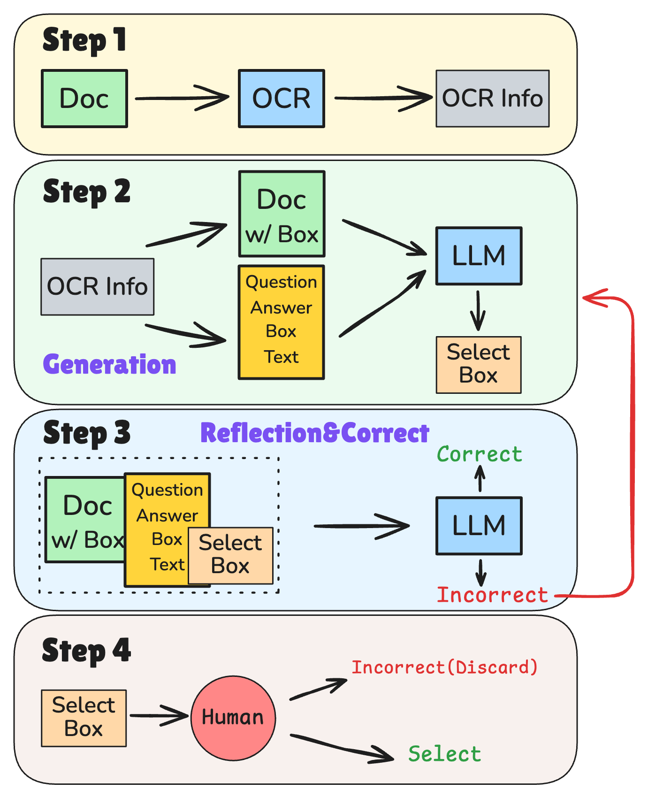
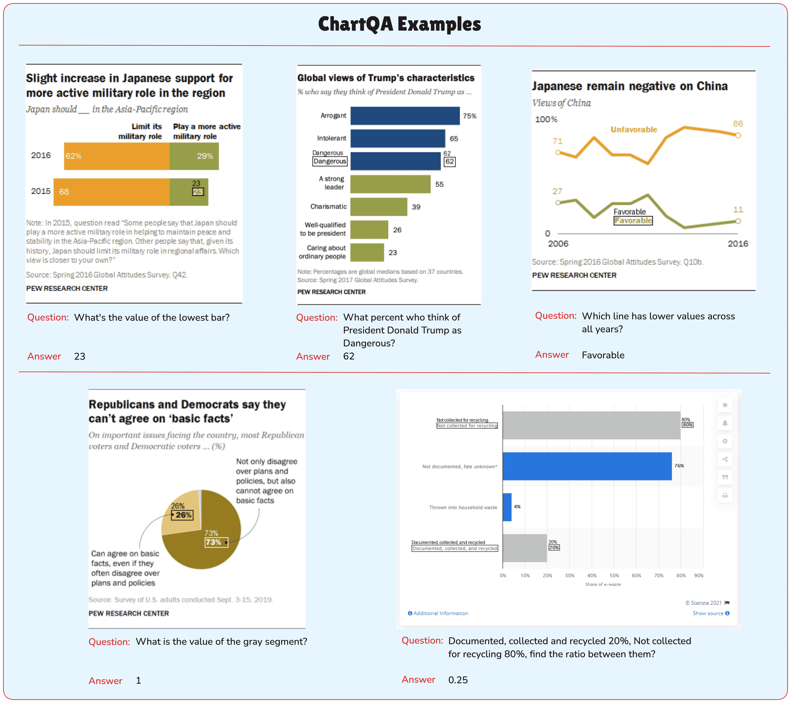

# Towards Visual Text Grounding of Multimodal Large Language Model

[Towards visual text grounding of multimodal large language model](https://arxiv.org/abs/2504.04974) <br>
Reasoning and Planning for LLMs @ ICLR2025 || ICLR 2025 Workshop SynthData

<p align="center" width="35%">
<a ></a>
</p>

This is the repo for the TRIG project, which introduces the task of **Text-Rich Image Grounding (TRIG)** for LMMLs. <br>

This repo mainly contains the benchmark data for TRIG and the corresponding minimal evaluation scripts. 

## Contents
- [Overview](#overview)
- [Highlights](#highlights)
- [Benchmark](#benchmark)
- [Evaluation](#evaluation)
- [Examples](#examples)
- [Citation](#citation)

## Overview

Despite the existing evolution of Multimodal Large Language Models (MLLMs), a non-neglectable limitation remains in their struggle with visual text grounding, especially in text-rich images of documents. Document images, such as scanned forms and infographics, highlight critical challenges due to their complex layouts and textual content. However, current benchmarks do not fully address these challenges, as they mostly focus on visual grounding on natural images, rather than text-rich document images. Thus, to bridge this gap, we introduce TRIG, a novel task with a newly designed instruction dataset for benchmarking and improving the Text-Rich Image Grounding capabilities of MLLMs in document question-answering. Specifically, we propose an OCR-LLM-human interaction pipeline to create 800 manually annotated question-answer pairs as a benchmark and a large-scale training set of 90k synthetic data based on four diverse datasets. A comprehensive evaluation of various MLLMs on our proposed benchmark exposes substantial limitations in their grounding capability on text-rich images. In addition, we propose two simple and effective TRIG methods based on general instruction tuning and plug-and-play efficient embedding, respectively. By finetuning MLLMs on our synthetic dataset, they promisingly improve spatial reasoning and grounding capabilities.

## Highlights

* We introduce a novel task, **Text-Rich document Tmage Grounding (TRIG)**, along with its corresponding benchmark TRIG-Bench. The dataset and benchmark are the first of their kind and provide a standardized framework for evaluating MLLMs in this domain, filling a critical gap in existing research.
* We propose two types of methods to tackle the challenging visual text grounding task, including the straightforward instruction-tuning-based method and a novel efficient embedding-based method, which not only provide baseline performances but also offer more insight into document grounding.
* We perform a comprehensive evaluation of a range of existing MLLMs on our new benchmark. Our analysis provides a deeper understanding of the limitations and constraints of current MLLMs: although most current MLLMs perform well on well-defined tasks, they lack the capability to follow customized and complex tasks that require deep understanding and reasoning capabilities.

## Benchmark

### Data Sources

TRIG-Bench consists of 800 question-answer pairs manually collected from DocVQA, ChartQA, InfographicsVQA, and TRINS datasets, along with human-inspected ground-truth bounding boxes that support the answer to the corresponding question.

<p align="center" width="95%">
<a ></a>
</p>

### Data Construction

- **Step 1 Preprocessing**: Use PaddleOCR2 to obtain initial OCR information.
- **Step 2 Generation**: Draw indexed OCR bounding boxes on the original image and provide indexed OCR information in the prompt for LLM alignment.
- **Step 3 Correction**: Apply a Reflection & Rectification module to check and correct the selected bounding boxes.
- **Step 4 Human Evaluation**: Human evaluation of samples processed by the LLM.

<p align="center" width="45%">
<a ></a>
</p>

## Evaluation

### Folders

The benchmark directory is organized in a flat, repeatable structure so that evaluation scripts can iterate over files without any dataset-specific logic:

```text
benchmark/
├── ChartQA/
│   ├── 0.png … 199.png
│   └── meta.json
├── DocVQA/
│   ├── 0.png … 199.png
│   └── meta.json
├── InfographicsVQA/
│   ├── 0.png … 199.png
│   └── meta.json
└── TrinsQA/
    ├── 0.png … 199.png
    └── meta.json
```

Key points:

* Each top-level folder corresponds to one of the four public datasets included in TRIG-Bench.
* Every folder contains exactly 200 PNG images (renamed to contiguous indices for consistency) plus a single `meta.json` file.
* The `meta.json` file stores the question, answer and the ground-truth bounding boxes that justify the answer for each image.

### `meta.json` format (per-sample)

```jsonc
{
  "id": "0",                 // unique identifier within the subset
  "image_path": "0.png",      // relative path to the PNG image
  "question": "<Q>",          // question string
  "answers": ["<A>", ...],   // one or more acceptable answers
  "bbox_all": [                // OCR tokens or lines (top, left, width, height, text)
    [t, l, w, h, "text"],
    ...
  ],
  "grounding": [               // subset of boxes that support the answer
    [t, l, w, h, "text"],
    ...
  ]
}
```

All coordinates are absolute pixel values w.r.t. the top-left corner of the image.  
`bbox_all` provides full OCR context, while `grounding` holds only the evidence boxes.

An example code for testing OpenAI models are provided in `test_pipeline_gpt4o_simple.py`. 

### Quick Start with `test_pipeline_gpt4o_simple.py`

`test_pipeline_gpt4o_simple.py` is a lightweight, end-to-end evaluator that:
1. Loads TRIG-Bench metadata.
2. Wraps each question into a vision-language prompt (three prompt variants).
3. Calls an OpenAI vision model (default: **gpt-4o-mini**).
4. Parses the returned bounding boxes.
5. Computes IoU / Precision / Recall / F1 against the ground truth.

#### Command-line arguments

| Flag | Default | Description |
|------|---------|-------------|
| `--testset` | `ChartQA` | Which subset to evaluate; set to `All` to iterate over the four datasets. |
| `--end_idx` | `0` | Evaluate only the first *N* samples; `0` means all samples. |
| `--save_name` | `try_results_gpt4o_simple.json` | Where to store per-sample details and aggregated results. |
| `--test_version` | `1` | Prompt style: `1` (generation), `2` (selection w/ text), `3` (selection w/o text). |
| `--model_name` | `gpt-4o-mini` | OpenAI model identifier (e.g., `gpt-4o`, `gpt-4o-mini`). |

#### Core functions

* **`parse_args()`** – exposes the CLI arguments listed above.
* **`get_question_prompt()`** – builds the task prompt from question, OCR boxes and image.
* **`call_gpt()`** – sends the prompt & image to the OpenAI API and retrieves the raw response.
* **`evaluate()`** – extracts predicted boxes and computes IoU / P / R / F1.
* **`main()`** – orchestration loop: iterate samples → prompt → model call → metric calculation → save.

Example: evaluate the first 5 DocVQA samples with GPT-4o-mini

```bash
python test_pipeline_gpt4o_simple.py \
  --testset DocVQA \
  --model_name gpt-4o-mini
```

> **Note**: export your `OPENAI_API_KEY` environment variable before running the script.

## Examples

Below are one-shot visual examples from each TRIG-Bench subset.

### ChartQA
<p align="center">
  
</p>

### DocVQA
<p align="center">
  
</p>

### InfographicsVQA
<p align="center">
  
</p>

### TRINS
<p align="center">
  
</p>

## Citation

Please consider citing our papers if you think our codes, data, or models are useful. Thank you! <br>

```
@article{li2025towards,
  title={Towards visual text grounding of multimodal large language model},
  author={Li, Ming and Zhang, Ruiyi and Chen, Jian and Gu, Jiuxiang and Zhou, Yufan and Dernoncourt, Franck and Zhu, Wanrong and Zhou, Tianyi and Sun, Tong},
  journal={arXiv preprint arXiv:2504.04974},
  year={2025}
}
